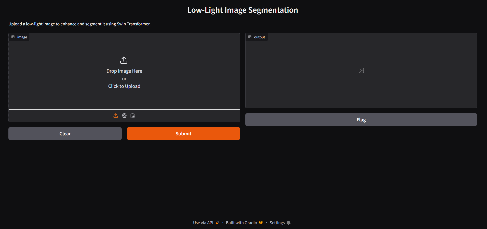

## **Synthetic Data Generation & Model Optimization for Low-Light Image Segmentation**  

### developed by Aakash Sharma
### **📌 Project Overview**
🔹 **Tech Stack**: OpenCV, CNN, Vision Transformers, Model Optimization, Synthetic Data Creation, Segmentation  
🔹 **Concept**: Develop a model that **enhances and segments images taken in low-light conditions** using **synthetic dataset generation** and **EfficientNet for segmentation**.  

**Screenshot**: 

✅ **Key Features:**  
- **GAN-based synthetic data generation** for low-light conditions  
- Uses **Swin Transformer for segmentation**  
- Optimized with **Pruning & Quantization** for efficiency  
- Django-based interface with **real-time segmentation preview**  
- GitHub repo with **synthetic dataset + pretrained model**  

🚀 **Showcase Boost:** **"Synthetic Data + Vision Transformers for Low-Light Image Segmentation!"**  